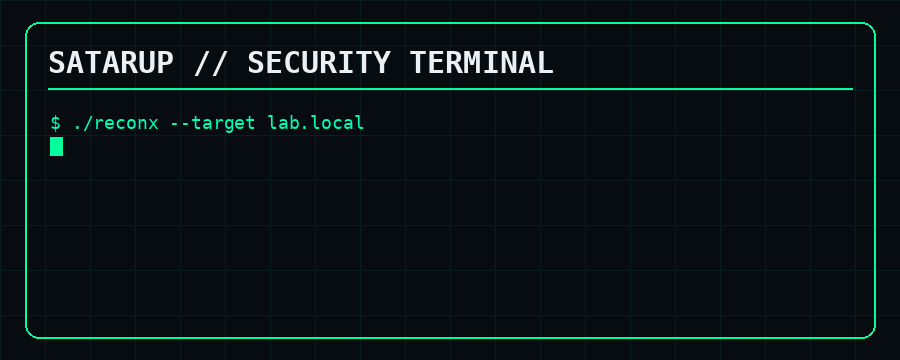

<div align="center">



<br>


<br><br>

<a href="https://github.com/satarup-mondal"></a>
<a href="https://instagram.com/sata.n0xx"></a>
<a href="https://wa.me/916901099890"></a>
<a href="mailto:satarup69@gmail.com"></a>

</div>

---

## `> whoami`

```text
┌──(satarup㉿kali)-[~]
└─$ whoami

Cybersecurity Developer
Penetration Testing Learner
Red Team Enthusiast
Security Automation Builder
Linux / Cloud Security Explorer
```

I don't just run tools. I want to understand the **mechanism behind the attack** — then automate the repetitive parts.

```text
RECON → ENUMERATION → VULN ANALYSIS → EXPLOITATION
                                      ↓
                         PRIVILEGE ESCALATION
                                      ↓
                              DOCUMENTATION
```

> **Understand the system. Understand the attack path. Build better defenses.**

---

# `⚔️ SECURITY SKILLS`

<div align="center">


</div>

### 🔴 Offensive Security
`Nmap` · `Burp Suite` · `Metasploit` · `Gobuster` · `Dirsearch` · `Nikto` · `SQLmap` · `ffuf` · `Feroxbuster` · `Nuclei`

### 🌐 Web & API Security
`OWASP Top 10` · `HTTP/S` · `REST APIs` · `Authentication` · `Authorization` · `Directory Discovery` · `Request Analysis`

### 🛰️ Network Security
`Wireshark` · `tcpdump` · `Hping3` · `Netcat` · `Nmap NSE` · `DNS` · `SMB` · `NetBIOS` · `LLMNR`

### 🪟 Windows / AD
`Impacket` · `NetExec` · `Evil-WinRM` · `enum4linux-ng` · `smbclient` · `Responder` · `Kerbrute`

### 🔐 Credential & Hash Testing
`Hashcat` · `John the Ripper` · `Hydra` · `RockYou` · `CVE Research`

### 🔎 OSINT / Recon
`Maltego` · `Amass` · `Subfinder` · `DNS Enumeration` · `Subdomain Discovery` · `Google Dorks`

---

# `🤖 SECURITY AUTOMATION`

```python
class ReconEngine:

    def run(self, target):
        scope = self.validate_scope(target)
        dns = self.enumerate_dns(scope)
        ports = self.scan_ports(scope)
        services = self.identify_services(ports)
        web = self.fingerprint_web(services)

        return self.build_report(
            dns=dns,
            ports=ports,
            services=services,
            web=web
        )
```

**Automation stack:** `Python` · `Bash` · `AsyncIO` · `REST APIs` · `JSON` · `Regex` · `Linux CLI` · `GitHub Actions`

---

# `☁️ DEVOPS / CLOUD / CONTAINERS`

<div align="center">


</div>

`Docker` · `Kubernetes` · `Linux` · `GitHub Actions` · `CI/CD` · `Container Security`

---

# `💻 DEVELOPMENT`

| Area | Stack |
|---|---|
| 🐍 Security Automation | Python, Bash |
| ⚙️ Systems | C, Rust, Linux |
| 🌐 Web | JavaScript, React, Node.js, Express, Next.js |
| 🐳 Infrastructure | Docker, Kubernetes |
| 🔧 Tooling | Git, GitHub Actions, VS Code |

---

# `🚀 FEATURED BUILD`

## 🔴 ReconX — Reconnaissance & Automation Platform

```text
                    TARGET
                      │
             ┌────────┴────────┐
             ↓                 ↓
        DNS ENUM          PORT SCAN
             │                 │
             └────────┬────────┘
                      ↓
              SERVICE DETECTION
                      ↓
              HTTP FINGERPRINTING
                      ↓
             DIRECTORY DISCOVERY
                      ↓
                ATTACK SURFACE
                      ↓
                  REPORT / API
```

> Turning repetitive reconnaissance into a repeatable security workflow.

---

# `🧪 LABS / RESEARCH`

`TryHackMe` · `Hack The Box` · `Metasploitable` · `OWASP vulnerable apps`

```text
DISCOVER → UNDERSTAND → VALIDATE IN LAB → DOCUMENT → IMPROVE
```

---

# `📊 GITHUB`

<div align="center">


<br><br>


</div>

---

# `🐍 CONTRIBUTION MATRIX`

<div align="center">

<picture>
  <source media="(prefers-color-scheme: dark)" srcset="https://raw.githubusercontent.com/satarup-mondal/satarup-mondal/output/github-snake-dark.svg">
  <source media="(prefers-color-scheme: light)" srcset="https://raw.githubusercontent.com/satarup-mondal/satarup-mondal/output/github-snake.svg">
  
</picture>

</div>

---

# `🎯 ROADMAP`

```text
[████████████████████] Cybersecurity Fundamentals
[████████████████░░░░] Web Application Security
[███████████████░░░░░] Network Security
[██████████████░░░░░░] Linux Privilege Escalation
[████████████░░░░░░░░] Security Automation
[███████████░░░░░░░░░] Red Teaming
[██████████░░░░░░░░░░] Cloud / Container Security
[████████░░░░░░░░░░░░] Custom Security Tooling
```

---

# `🧠 MINDSET`

```python
def security_engineer(target):

    recon(target)
    enumerate(target)
    understand(target)
    identify_weakness(target)
    validate_in_lab(target)
    automate_repeatable_work()
    document_findings()
    improve_defenses()

    return "Understand before you exploit."
```

---

# `📡 CONNECT`

<div align="center">

<a href="https://github.com/satarup-mondal"></a>
<a href="https://instagram.com/sata.n0xx"></a>
<a href="https://wa.me/916901099890"></a>
<a href="mailto:satarup69@gmail.com"></a>

<br><br>

`BUILD. BREAK. UNDERSTAND. DEFEND.`

</div>
