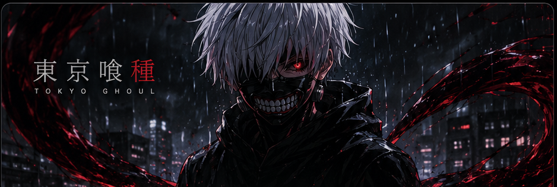

<!-- Minimal gradient banner -->

 

◈ CONNECT

&nbsp;

&nbsp;

&nbsp;

◈ SKILLS & TECH STACK

Languages

Frameworks & Technologies

Security & Offensive Security

Security Toolkit

Nmap · Burp Suite · Wireshark · Metasploit · Gobuster · ffuf · Nikto · SQLMap · Hashcat · John the Ripper · Nessus · SearchSploit

◈ GITHUB STATS

<table>
<tr>
<td width="62%">

 

</td>

<td width="38%" align="center">

</td>
</tr>
</table>

◈ CONTRIBUTION GRAPH

LEARN. HACK. BUILD. REPEAT.

// Security is a mindset, not a tool.

